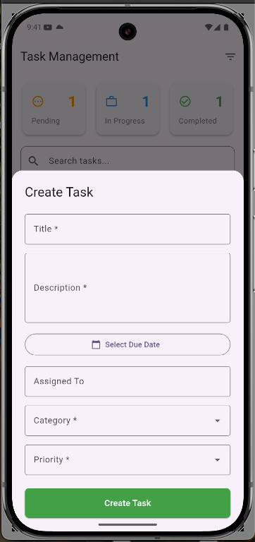
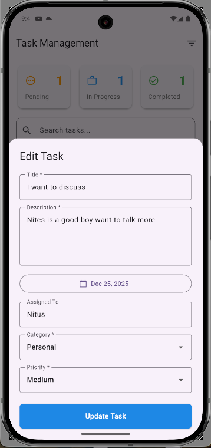
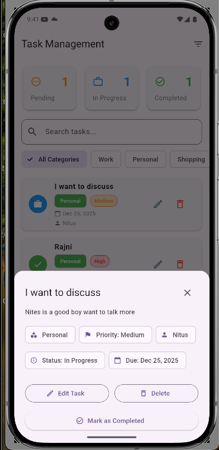
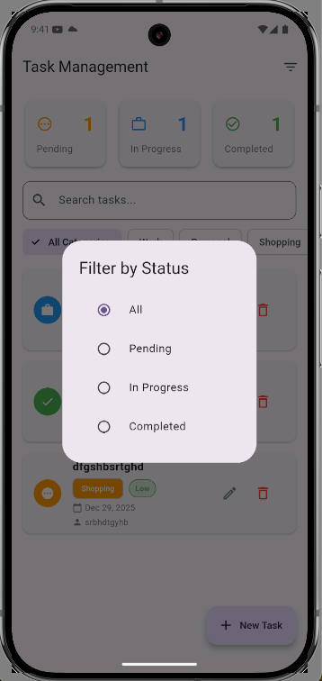

# Task Management Application

A smart task management system built with Flutter and Node.js that automatically classifies and organizes tasks based on content analysis using intelligent keyword detection.

## 📱 Project Overview

This application provides a comprehensive task management solution with:

- **Automatic Task Classification**: Intelligently categorizes tasks based on keywords in title and description
- **Priority Detection**: Automatically assigns priority levels (High, Medium, Low) based on urgency indicators
- **Entity Extraction**: Extracts important information like dates, people, and locations from task descriptions
- **Suggested Actions**: Provides context-aware action suggestions based on task category
- **Real-time Status Updates**: Automatic status progression from Pending → In Progress → Completed
- **Offline Support**: Handles network connectivity gracefully with offline indicators

## 🛠️ Tech Stack

### Frontend (Flutter)

- **Framework**: Flutter 3.9.2+
- **State Management**: Provider
- **HTTP Client**: Dio
- **UI**: Material Design 3
- **Connectivity**: connectivity_plus
- **Date Formatting**: intl

### Backend

- **Runtime**: Node.js
- **Database**: PostgreSQL/Supabase
- **API**: RESTful API

### Key Dependencies

```yaml
provider: ^6.1.5+1
dio: ^5.9.0
connectivity_plus: ^7.0.0
intl: ^0.20.2
```

## 🚀 Setup Instructions

### Prerequisites

- Flutter SDK (3.9.2 or higher)
- Dart SDK
- Android Studio / Xcode (for mobile development)
- Node.js and npm (for backend)
- PostgreSQL or Supabase account

### Backend Setup

1. **Clone the repository**

   ```bash
   git clone https://github.com/rajnikant2002/smart-task-backend.git
   cd smart-task-backend
   ```

2. **Install backend dependencies**

   ```bash
   cd backend
   npm install
   ```

3. **Configure environment variables**
   Create a `.env` file:

   ```env
   DATABASE_URL=your_supabase_connection_string
   PORT=3000
   ```

4. **Run database migrations**

   ```bash
   npm run migrate
   ```

5. **Start the backend server**

   ```bash
   npm start
   ```

   The API will be available at `http://localhost:3000/api`

### Flutter App Setup

1. **Navigate to the project directory**

   ```bash
   cd task_management
   ```

2. **Install Flutter dependencies**

   ```bash
   flutter pub get
   ```

3. **Configure API endpoint** (if needed)

   For Android Emulator (default):

   - Uses `http://10.0.2.2:3000/api` automatically

   For iOS Simulator:

   - Uses `http://localhost:3000/api` automatically

   For Physical Device:

   - Update `lib/main.dart`:

   ```dart
   create: (_) => ApiService(baseUrl: 'http://YOUR_COMPUTER_IP:3000/api'),
   ```

4. **Run the app**
   ```bash
   flutter run
   ```

## 📡 API Documentation

### Base URL

```
http://localhost:3000/api (Development)
http://your-render-url.onrender.com/api (Production)
```

### Endpoints

#### 1. Create Task (with Auto-Classification)

```http
POST /api/tasks
Content-Type: application/json

Request Body:
{
  "title": "Schedule urgent meeting with team today about budget",
  "description": "Need to discuss budget allocation with the team",
  "dueDate": "2025-12-28T00:00:00",
  "assignedTo": "John Doe",
  "category": "Work",
  "priority": "High",
  "status": "pending"
}

Response:
{
  "success": true,
  "data": {
    "id": "uuid",
    "title": "Schedule urgent meeting...",
    "category": "scheduling",
    "priority": "high",
    "status": "pending",
    "extractedEntities": {
      "dates": ["today"],
      "people": ["team"],
      "topics": ["budget allocation"]
    },
    "suggestedActions": [
      "Block calendar",
      "Send invite",
      "Prepare agenda"
    ],
    "createdAt": "2025-12-25T16:05:19.176272",
    "updatedAt": "2025-12-25T16:05:19.176272"
  },
  "message": "Task created successfully"
}
```

#### 2. Get Auto-Classification Preview

```http
POST /api/tasks/classify
Content-Type: application/json

Request Body:
{
  "title": "Schedule urgent meeting with team",
  "description": "Need to discuss budget allocation"
}

Response:
{
  "category": "scheduling",
  "priority": "high",
  "extractedEntities": {
    "dates": ["today"],
    "people": ["team"]
  },
  "suggestedActions": [
    "Block calendar",
    "Send invite"
  ]
}
```

#### 3. List All Tasks

```http
GET /api/tasks?status=pending&category=Work&priority=high

Query Parameters:
- status: pending | in_progress | completed
- category: Work | Personal | Shopping | Health | Other
- priority: low | medium | high
- limit: number (pagination)
- offset: number (pagination)

Response:
{
  "success": true,
  "data": [
    {
      "id": "uuid",
      "title": "Task title",
      "description": "Task description",
      "category": "Work",
      "priority": "High",
      "status": "in_progress",
      ...
    }
  ]
}
```

#### 4. Get Task by ID

```http
GET /api/tasks/{id}

Response:
{
  "success": true,
  "data": {
    "id": "uuid",
    "title": "Task title",
    ...
  }
}
```

#### 5. Update Task

```http
PATCH /api/tasks/{id}
Content-Type: application/json

Request Body:
{
  "title": "Updated title",
  "status": "in_progress",
  "category": "Work",
  "priority": "High"
}

Response:
{
  "success": true,
  "data": {
    "id": "uuid",
    "title": "Updated title",
    ...
  },
  "message": "Task updated successfully"
}
```

#### 6. Delete Task

```http
DELETE /api/tasks/{id}

Response:
{
  "success": true,
  "message": "Task deleted successfully"
}
```


## 📸 Screenshots

### Dashboard Screen


_Main dashboard showing task summary cards, filters, and task list_

### Task Creation Form


_Task creation form with all required fields_

### Auto-Classification Preview


_Auto-classification preview dialog showing detected category, priority, and suggested actions_

### Task Details View


_Detailed task view with all information and action buttons_

### Task List with Filters


_Filtered task list showing tasks by category and priority_

## 🏗️ Architecture Decisions

### State Management: Provider

- **Why**: Simple, well-documented, and perfect for this app's complexity
- **Benefits**:
  - Easy to understand and maintain
  - Good performance with `Consumer` widgets
  - No boilerplate code
  - Excellent Flutter community support

### HTTP Client: Dio

- **Why**: More features than `http` package
- **Benefits**:
  - Built-in interceptors for logging and error handling
  - Request/response transformation
  - Better error handling
  - Support for canceling requests

### UI Framework: Material Design 3

- **Why**: Modern, accessible, and follows Google's design guidelines
- **Benefits**:
  - Consistent look and feel
  - Built-in accessibility features
  - Responsive design components
  - Theme customization

### Auto-Classification Flow

- **Decision**: Show preview before final submission
- **Why**:
  - User can review and override AI suggestions
  - Better user experience and trust
  - Allows manual correction if needed

### Status Progression

- **Decision**: Automatic status update (Pending → In Progress when opened)
- **Why**:
  - Reflects real-world workflow
  - Reduces manual status updates
  - Better task tracking

## ✨ Key Features

### 1. Smart Task Classification

- Automatically detects category from keywords:
  - **Scheduling**: meeting, schedule, call, appointment, deadline
  - **Finance**: payment, invoice, bill, budget, cost, expense
  - **Technical**: bug, fix, error, install, repair, maintain
  - **Safety**: safety, hazard, inspection, compliance, PPE
  - **General**: default fallback

### 2. Priority Detection

- **High**: urgent, asap, immediately, today, critical, emergency
- **Medium**: soon, this week, important
- **Low**: default

### 3. Entity Extraction

- Extracts dates, times, person names, locations, and action verbs from descriptions

### 4. Suggested Actions

- Context-aware suggestions based on category:
  - Scheduling: Block calendar, Send invite, Prepare agenda
  - Finance: Check budget, Get approval, Generate invoice
  - Technical: Diagnose issue, Check resources, Assign technician
  - Safety: Conduct inspection, File report, Notify supervisor

### 5. Real-time Updates

- Reactive UI using Provider
- Automatic status updates
- Live summary card counts
- Pull-to-refresh support

### 6. Offline Support

- Connectivity monitoring
- Visual offline indicator
- Graceful error handling

## 🔄 What I'd Improve (Given More Time)

### Short-term Improvements

1. **Dark Mode Support**: Add theme switching for better user experience
2. **Task Search with Highlighting**: Improve search UX with highlighted matches
3. **Export to CSV**: Allow users to export tasks for reporting
4. **Real-time Sync**: Implement Supabase real-time subscriptions for live updates
5. **Task History View**: Show complete audit trail of task changes

### Medium-term Enhancements

1. **Rate Limiting**: Add API rate limiting for better security
2. **API Key Authentication**: Implement proper authentication
3. **Swagger/OpenAPI Documentation**: Auto-generate API docs
4. **Unit Tests**: Expand test coverage for classification logic
5. **Integration Tests**: Add end-to-end testing

### Long-term Features

1. **AI-Powered Suggestions**: Use ML models for better classification
2. **Task Templates**: Pre-defined task templates for common workflows
3. **Collaboration Features**: Multi-user support with permissions
4. **Notifications**: Push notifications for task reminders
5. **Analytics Dashboard**: Task completion analytics and insights
6. **Recurring Tasks**: Support for repeating tasks
7. **Task Dependencies**: Link related tasks
8. **File Attachments**: Attach documents to tasks
9. **Comments/Notes**: Add comments to tasks
10. **Calendar Integration**: Sync with Google Calendar/Outlook

## 🧪 Testing

### Unit Tests

The project includes unit tests for:

- Task classification logic
- Status parsing
- Priority detection
- Category mapping

Run tests with:

```bash
flutter test
```

**Note**: Make sure your backend server is running before starting the Flutter app. The app will automatically detect the platform and use the appropriate API endpoint.
